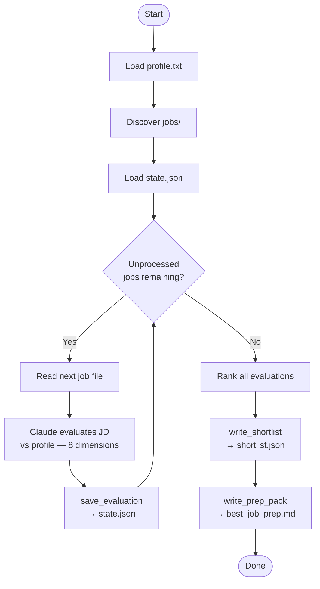
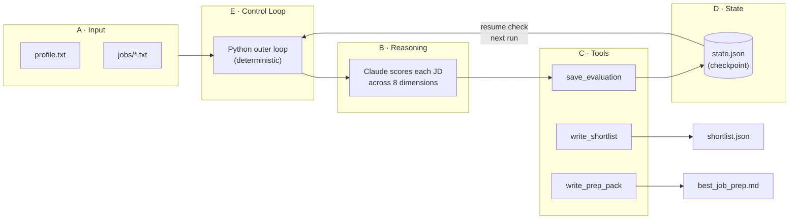
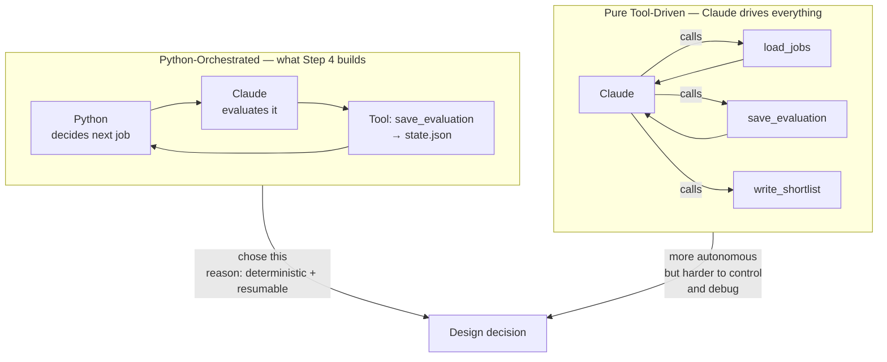
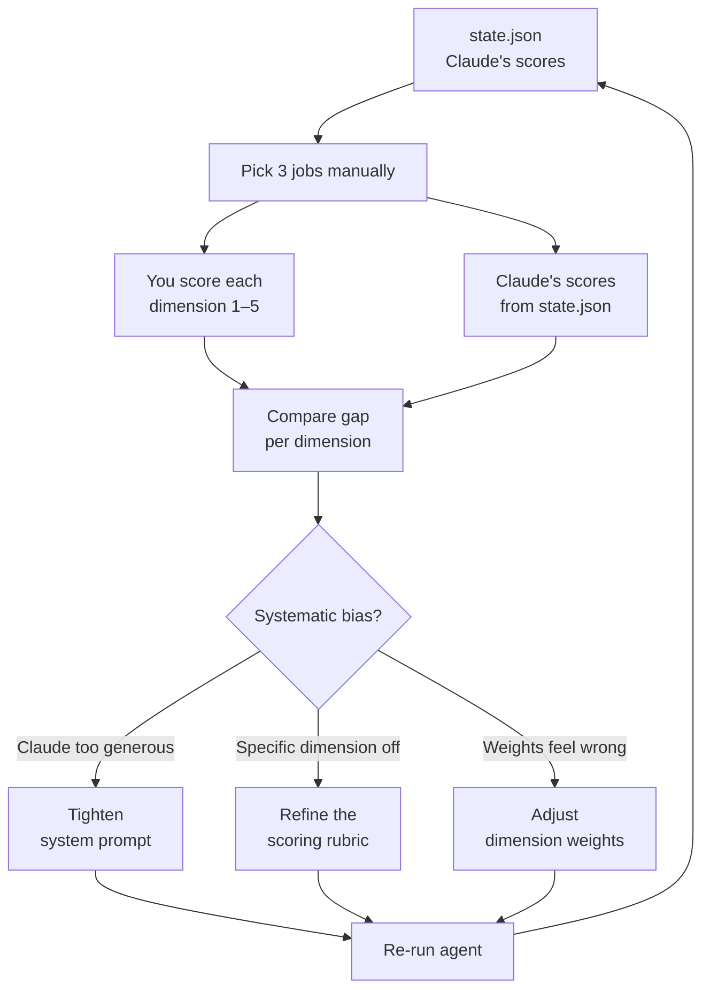

# job-post-agent-lab

A personal learning lab for building AI agents step by step using the [Claude Agent SDK](https://github.com/anthropics/claude-agent-sdk).

**Goal:** go from a simple one-shot API call to a fully autonomous agentic loop — one concept at a time.

**Rule:** start simple, test each step, then add one new capability.

---

## Learning Journey

| Step | File | Concept | What it does |
|------|------|---------|--------------|
| 1 | `step1_query.py` | One-shot call | Sends a job description to Claude, gets a single analysis back. No memory, no tools. |
| 2 | `step2_memory.py` | Session memory | Opens a session so Claude remembers what was said earlier in the same run. |
| 3 | `step3_tools.py` | Tools | Gives Claude two local tools: save an analysis to JSON, or load previously saved ones. |
| 4 | `step4_loop.py` | Agentic loop | Claude works autonomously through a batch of job files, scores each one, ranks them, and writes a prep pack — no hand-holding required. |

---

## Step 4 — Agentic Loop (deep dive)

### What it does

Instead of waiting for a human after each step, the agent runs a deterministic loop from start to finish and stops only when all work is done.

### Strategy



This gives you: iterative progress, resumability, and a clear stopping condition.

### Architecture (5 layers)



### Agentic patterns — why Python-orchestrated?

Two valid designs exist. This project uses the first one deliberately.



| | Python-orchestrated | Pure tool-driven |
|---|---|---|
| Who drives the loop | Python | Claude |
| Resumability | Easy — Python tracks state | Harder — depends on Claude |
| Predictability | High | Lower |
| Autonomy | Medium | High |
| Best for | Batch jobs, reliability | Open-ended tasks |

### Output files

| File | Description |
|------|-------------|
| `state.json` | Intermediate scores per job (resumability checkpoint) |
| `shortlist.json` | Ranked list of all evaluated jobs |
| `best_job_prep.md` | Full interview prep pack for the top-ranked job |

### What's missing — the eval layer

Building the agent is step one. Knowing if its outputs are correct is step two. This is called **evaluation**, and it is the hardest skill in agent engineering.



Without this loop, you have a confident system that may be consistently wrong. Most beginners skip it. Don't.

---

## Setup

**Prerequisites:**
- Python 3.10+
- Claude Code CLI installed and authenticated (`claude` in your PATH)

**Install dependencies:**
```bash
python -m venv .venv
source .venv/bin/activate   # on Windows: .venv\Scripts\activate
pip install -r requirements.txt
```

**Set your API key:**
```bash
cp .env.example .env
# then edit .env and add your key
```

**Add a job description:**

Create a `notes.txt` file in the project root and paste any job posting into it.

---

## Running each step

```bash
python step1_query.py   # one-shot analysis
python step2_memory.py  # interactive session with memory
python step3_tools.py   # session with save/load tools
```

Type `exit` or press `Ctrl+C` to quit any interactive step.
